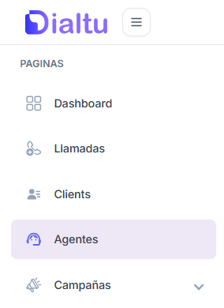

## <Icon icon="circle-play" color="#af19ef" size={30} /> Video:

Aquí podrás encontrar un video explicativo que te guiará visualmente durante todo el proceso.

## <Icon icon="stairs" color="#af19ef" size={30} /> Paso a Paso:

<Steps>
  <Step title="Ingresa a la sección “Agentes”" stepNumber={1} titleSize="h3">
    En el menú lateral izquierdo, selecciona la opción **Agentes** para comenzar a configurar uno nuevo.

    
  </Step>
  <Step title="Crea un nuevo agente" titleSize="h3">
    Haz clic en el botón **“Crear Agente”** para iniciar el proceso.
  </Step>
  <Step title="Añade un nombre y descripción para tu agente" titleSize="h3">
    Escribe un **nombre** y una **descripción breve**. Esto te ayudará a identificarlo fácilmente más adelante. Estos campos no afectan la forma en que funciona el agente.
  </Step>
  <Step title="Configura la voz de tu agente" titleSize="h3">
    Elige entre las múltiples voces disponibles en Dialtu para dar personalidad a tu agente.\
    También selecciona:

    - **Modelo conversacional**: Define cómo interpretará y responderá durante las llamadas.
    - **Idioma**: Escoge el idioma en el que se comunicará.
  </Step>
  <Step title="Personaliza la conversación" titleSize="h3">
    Aquí es donde tu agente aprende a hablar y actuar según las necesidades de tu negocio:

    <AccordionGroup>
      <Accordion title="Contexto y Antecedentes">
        En esta sección le brindaremos al agente un transfondo, especificando como debe comportarse, detalles claves de la empresa, reglas que debe seguir y todo lo que se considere necesario para poder brindar una atención satisfactoria a la hora de recibir o agendar una llamada.
      </Accordion>
      <Accordion title="Flujo de la llamada y Guión">
        En esta sección le brindaremos al agente el guión que debe seguir a lo largo de la llamada como por ejemplo:

        - Saludo
        - Preguntas a realizar
        - Toma de decisiones
        - Escalamiento de la llamada
        - Cierre de la conversación

        Con esto le daremos al agente un paso a paso a seguir y el flujo que debe recorrer en la llamada.
      </Accordion>
      <Accordion title="Reglas de la llamada y Pautas">
        Lista de normas que no pueden romperse, como mantener un tono específico, cumplir protocolos de seguridad o seguir lineamientos internos.
      </Accordion>
    </AccordionGroup>
  </Step>
  <Step title="Preguntas frecuentes">
    Agrega preguntas y respuestas habituales de tus clientes. Esto hará que tu agente pueda resolver dudas de forma más rápida y eficiente.
  </Step>
  <Step title="Crea tu agente">
    Cuando todo esté listo, haz clic en **“Crear”**.\
    Tu agente aparecerá en la lista principal de la sección **Agentes**, listo para recibir o realizar llamadas. Podrás editarlo y mejorarlo tantas veces como quieras.
  </Step>
</Steps>